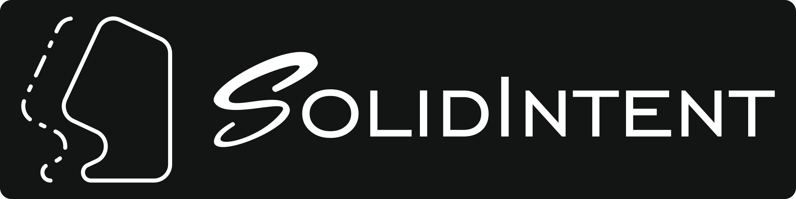
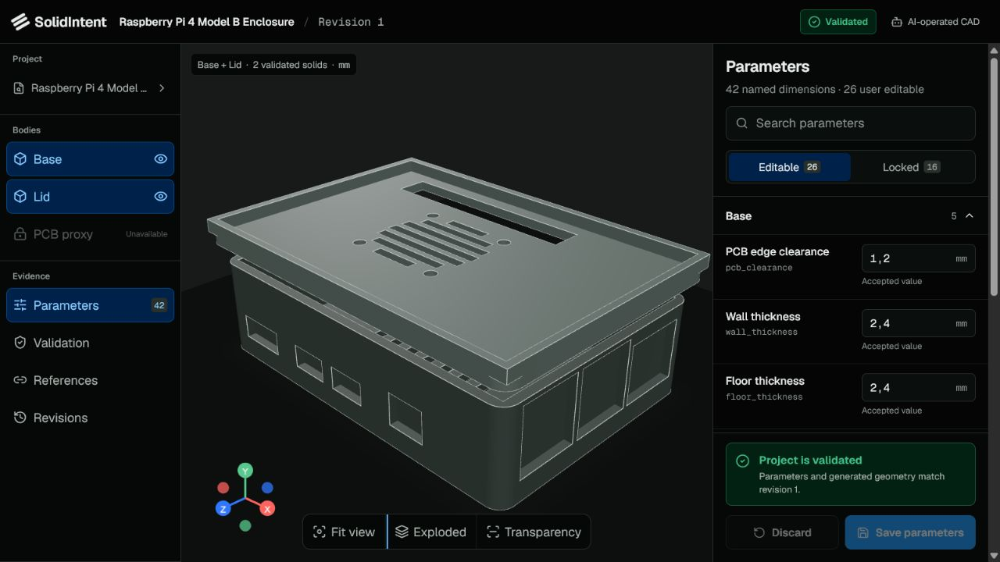
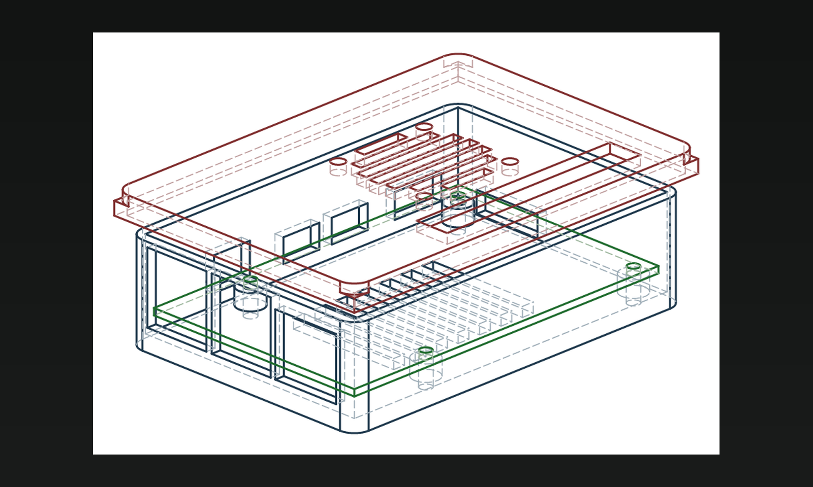
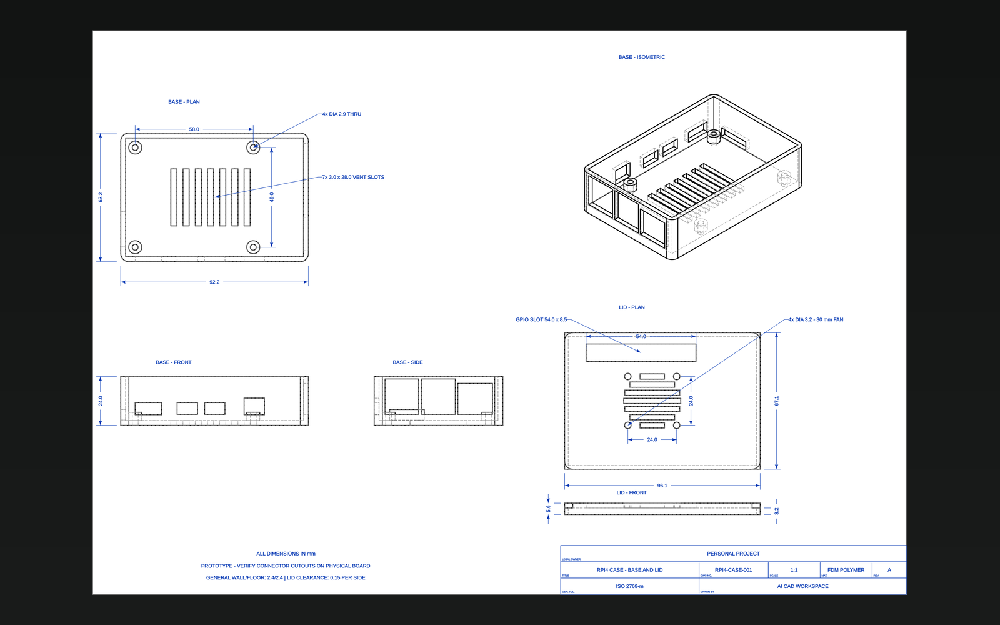
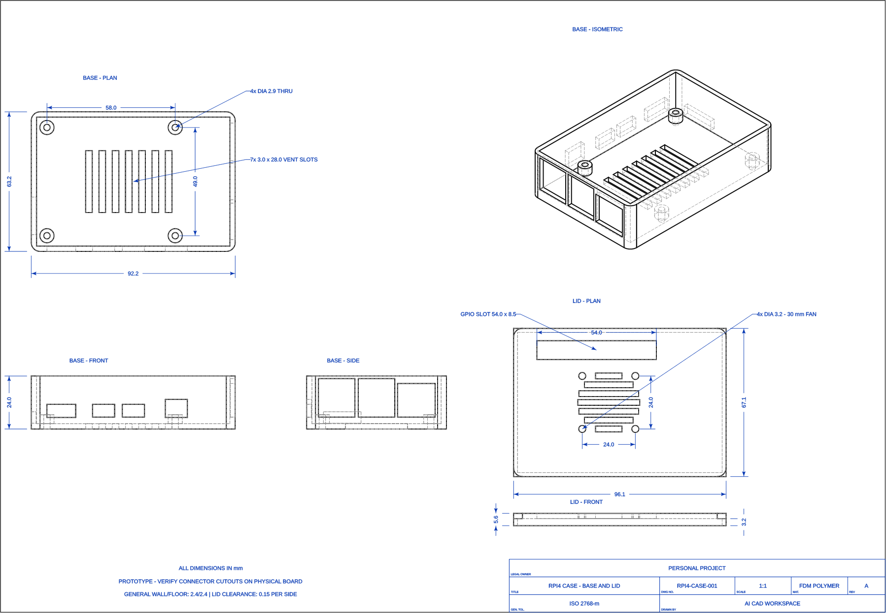
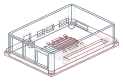
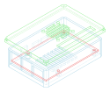
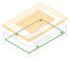
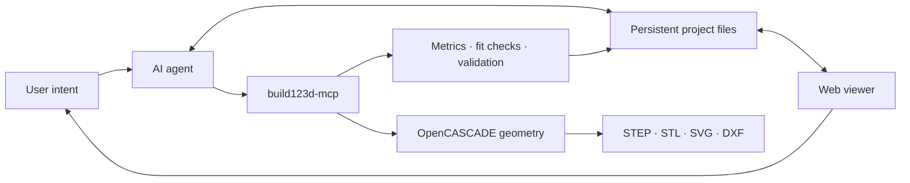

<p align="center">
  
</p>

# SolidIntent

**From intent to validated parametric solids.**

<p align="center">
  
</p>

<p align="center">
  <strong>An AI-first, headless CAD workspace built around persistent design intent.</strong><br>
  Ask the AI for a part, inspect the generated model, adjust approved dimensions,
  and preserve the evidence required to rebuild and validate it.
</p>

<p align="center">
  <a href="#product-tour">Product tour</a> ·
  <a href="#engineering-documentation">Engineering documentation</a> ·
  <a href="#how-it-works">How it works</a> ·
  <a href="#quick-start">Quick start</a>
</p>

## What SolidIntent provides

| Layer | Responsibility |
| --- | --- |
| AI agent | Creates and refines parametric models from natural-language intent. |
| Persistent project | Stores parameters, schema, references, validation evidence, and revision history. |
| `build123d-mcp` | Executes geometry, measures solids, renders views, validates topology, and exports files. |
| Web viewer | Displays generated STL bodies and lets users edit only schema-approved parameters. |

The browser is deliberately not a CAD kernel. It edits design intent and shows
accepted evidence; all engineering authority remains with `build123d-mcp` and
the project acceptance workflow.

## Product tour

<table>
  <tr>
    <td width="50%">
      
    </td>
    <td width="50%">
      
    </td>
  </tr>
  <tr>
    <td align="center"><sub>Exploded body inspection and schema-driven parameters</sub></td>
    <td align="center"><sub>Accepted geometric evidence from build123d-mcp</sub></td>
  </tr>
</table>

The current viewer discovers persistent projects, loads their real STL
artifacts, separates editable dimensions from reference-controlled values, and
derives clean or dirty state from accepted SHA-256 source hashes.

## Engineering documentation

<p align="center">
  <a href="docs/showcase/raspberry_pi4_case_dimensioned.svg">
    
  </a>
</p>

<p align="center"><sub>Combined A3 drawing with plan, front, side, and isometric views; dimensions in millimetres and an ISO 7200-style title block. Select the image for the full-resolution SVG.</sub></p>

<table>
  <tr>
    <td width="50%">
      
    </td>
    <td width="50%">
      
    </td>
  </tr>
  <tr>
    <td align="center"><sub>Assembled enclosure</sub></td>
    <td align="center"><sub>Exploded base and lid</sub></td>
  </tr>
</table>

The Pi 4 drawing is backed by SVG and DXF output plus an MCP annotation sidecar
for later machine inspection. Connector openings and the 0.15 mm lid clearance
still require verification on the exact physical board, printer, and material.

## Current projects

<table>
  <tr>
    <td width="50%">
      
    </td>
    <td width="50%">
      
    </td>
  </tr>
  <tr>
    <td valign="top">
      <strong>Raspberry Pi 4 Model B enclosure</strong><br>
      Persistent 42-parameter pilot with separate connector openings, microSD
      access, external cap lid, GPIO access, and a 30 mm fan pattern.
    </td>
    <td valign="top">
      <strong>Raspberry Pi 5 enclosure study</strong><br>
      A standalone parametric two-piece FDM script (<code>scripts/raspberry_pi5_case.py</code>)
      with a machine-readable design spec. It predates the persistent project
      contract and has not yet been migrated into <code>projects/</code>, so it has
      no manifest, schema-validated parameters, or accepted validation revision.
    </td>
  </tr>
</table>

The Pi 4 case is the first project on the persistent contract; the Pi 5 case is
an earlier parametric study. Both are prototypes: production use requires current
official hardware evidence and physical fit verification.

## How it works



1. The user describes a part or requests a change.
2. The AI edits named parameters or the canonical `build_model(parameters)`
   source.
3. `build123d-mcp` rebuilds, measures, compares, validates, and exports the
   geometry.
4. Accepted hashes, evidence, and revision records are written back to the
   persistent project.
5. The viewer presents the generated bodies and safe dimensional controls.

## Quick start

### CAD server

The upstream-recommended command used by this workspace is:

```text
uv tool run --python 3.12 build123d-mcp@latest --in-process
```

Python 3.11–3.14 are supported; this workspace uses Python 3.12 as the
conservative default. The `--in-process` fallback is used on this Windows Codex
host after large reference assemblies made isolated worker spawning unstable.
The host-level Codex sandbox remains the outer isolation boundary.

### Web viewer

```text
cd viewer
npm install
npm run dev
```

Open `http://127.0.0.1:4173`. Saving an allowed parameter updates
`parameters.json` atomically and marks the project as requiring an AI/MCP
rebuild. The viewer never regenerates, measures, validates, or exports geometry
itself.

## Project contract

`projects/raspberry_pi4_case/` is the first persistent project-format pilot.
Its manifest points to a `build_model(parameters)` entry point, schema-validates
42 parameters, exposes 26 user-editable controls, locks 16
reference-controlled values, tracks accepted source hashes, and stores
machine-readable validation and revision records.

A parameter or source edit makes the project dirty. The AI must rebuild it,
compare it with the accepted revision, run every applicable gate, and record a
new accepted revision before the project becomes clean again. See
[`docs/ai_cad_project_format.md`](docs/ai_cad_project_format.md) for the full
lifecycle.

## Modeling workflow

1. Call `version`, then `workflow_hints`, at the start of a fresh MCP session.
2. Read `build123d://quickref` before using unfamiliar build123d operations.
3. Build incrementally and assign stable names with `show()`.
4. Use `measure` after every important boolean.
5. Run fit, interference, and FDM orientation checks where applicable.
6. Run `validate` immediately before every final export.
7. Export through the MCP tool rather than custom file I/O.

See [`prompts/smoke-test.md`](prompts/smoke-test.md) for the connected-client
smoke test.

## Repository map

| Path | Contents |
| --- | --- |
| `projects/` | Persistent AI-editable project manifests and parameter state. |
| `scripts/` | Canonical parametric regeneration sources. |
| `specs/` | Machine-readable design intent and acceptance targets. |
| `viewer/` | Local React and Three.js project viewer. |
| `exports/` | Generated STEP, STL, DXF, and SVG files. |
| `renders/` | Generated review views. |
| `drawings/` | Dimensioned drawings and MCP annotation metadata. |
| `references/` | Drawings and imported comparison geometry. |
| `docs/` | Architecture, studies, screenshots, and curated showcase assets. |
| `notes/` | Test logs and design decisions. |
| `environment/` | Exact tool versions and environment validation. |

## Reference policy

Mechanical evidence is used in this order: current official manufacturer CAD,
measurements from the exact physical revision, official reference drawings,
trusted third-party CAD, and finally product images. Third-party assemblies are
evidence, not automatic production truth. See
[`references/README.md`](references/README.md) and [`AGENTS.md`](AGENTS.md) for
the complete policy.

## Credits and provenance

SolidIntent builds on the open-source
[`build123d-mcp`](https://github.com/pzfreo/build123d-mcp) project by
[`pzfreo`](https://github.com/pzfreo), distributed under the Apache License
2.0. The MCP server is installed as an external dependency; its source code is
not vendored in this repository.

The Raspberry Pi 4 pilot used Hasanain Shuja's
[`Raspberry Pi 4 Model B`](https://grabcad.com/library/raspberry-pi-4-model-b-1)
GrabCAD model as third-party dimensional and collision-reference evidence. The
downloaded package did not contain a licence file, so its native CAD files and
images are intentionally excluded from this repository. The enclosure itself
is a new parametric design and still requires physical connector verification.

See [`THIRD_PARTY_NOTICES.md`](THIRD_PARTY_NOTICES.md) and
[`references/README.md`](references/README.md) for the complete attribution and
redistribution policy.
