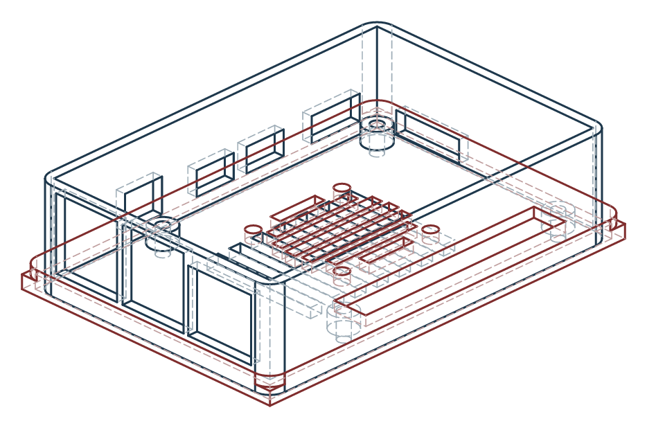
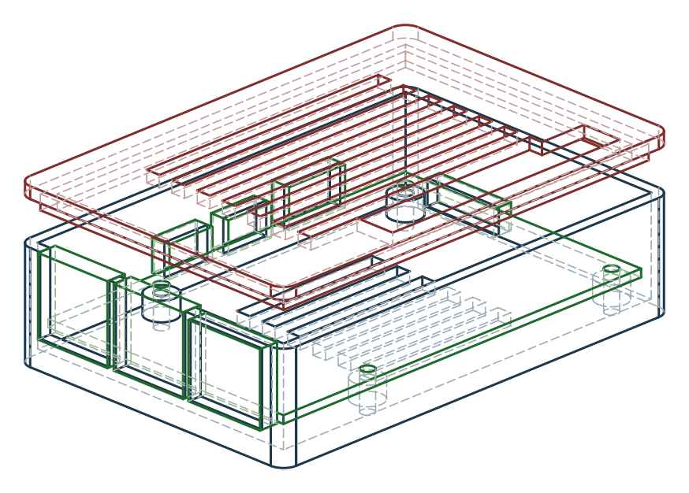
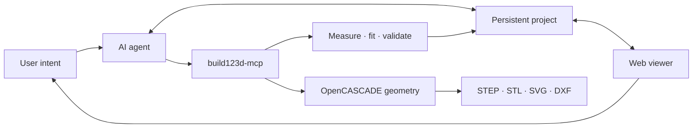

<p align="center">
  
</p>

<h1 align="center">SolidIntent</h1>

<p align="center">
  <strong>From intent to validated parametric solids.</strong><br>
  An AI-first CAD workspace where design intent stays editable, measurable, and rebuildable.
</p>

<p align="center">
  
</p>

<p align="center">
  <a href="#product-tour">Product tour</a> ·
  <a href="#projects">Projects</a> ·
  <a href="#quick-start">Quick start</a> ·
  <a href="#documentation">Docs</a>
</p>

---

## Why SolidIntent

Most AI CAD demos stop at a mesh preview. SolidIntent keeps a **persistent project**: named parameters, locked reference dimensions, validation evidence, and revision history — so you can reopen the same part later and trust what changed.

| Layer | Role |
| --- | --- |
| AI agent | Turns natural-language intent into parametric edits |
| Persistent project | Parameters, schema, references, validation, revisions |
| `build123d-mcp` | Geometry, measure, fit checks, validate, export |
| Web viewer | Inspect bodies and edit only schema-approved dimensions |

The browser is not a CAD kernel. It edits intent and shows evidence; engineering authority stays with `build123d-mcp` and the accept loop.

## Product tour

<table>
  <tr>
    <td width="50%">
      
    </td>
    <td width="50%">
      
    </td>
  </tr>
  <tr>
    <td align="center"><sub>Exploded inspection and schema-driven parameters</sub></td>
    <td align="center"><sub>Dimensioned evidence from the rebuild pipeline</sub></td>
  </tr>
</table>

## Projects

<table>
  <tr>
    <td width="50%" valign="top">
      <a href="docs/showcase/raspberry_pi4_case_assembled.svg">
        
      </a><br>
      <strong>Raspberry Pi 4 Model B enclosure</strong><br>
      <sub>Two-piece FDM case with connector openings, GPIO access, and a 30&nbsp;mm fan pattern.</sub>
    </td>
    <td width="50%" valign="top">
      <a href="docs/showcase/raspberry_pi5_case_exploded.svg">
        
      </a><br>
      <strong>Raspberry Pi 5 enclosure</strong><br>
      <sub>Persistent contract with Active Cooler keep-out, validation gates, and FDM print orientation.</sub>
    </td>
  </tr>
</table>

<p align="center">
  <a href="docs/showcase/raspberry_pi4_case_dimensioned.svg">
    
  </a><br>
  <sub>A3 dimensioned drawing — plan, front, side, isometric. Click for SVG.</sub>
</p>

Also included: a small slotted **mounting plate** pilot under `projects/mounting_plate/`.

## How it works



1. Describe a part or a change.
2. The agent edits parameters or `build_model(parameters)`.
3. `build123d-mcp` rebuilds, measures, compares, validates, and exports.
4. Accepted hashes and revision records are written back.
5. The viewer shows bodies and safe dimensional controls.

## Quick start

### CAD server

```bash
uv tool run --python 3.12 build123d-mcp@latest
```

### Web viewer

```bash
cd viewer
npm install
npm run dev
```

Open [http://127.0.0.1:4173](http://127.0.0.1:4173). Saving an allowed parameter updates `parameters.json` and marks the project dirty until rebuild/accept.

Local rebuild (CI-like gates without a live MCP session):

```bash
uv run --python 3.12 --with build123d --with jsonschema \
  python scripts/rebuild_project.py projects/raspberry_pi4_case --export --accept
```

## Project contract

Each project under `projects/<id>/` holds:

- `project.json` — manifest and artifact map  
- `parameters.json` / `parameter_schema.json` — editable source of truth  
- `validation.json` + `revisions/` — accepted evidence  
- `references.json` — provenance  

A parameter or source edit makes the project **dirty**. Rebuild, compare, pass gates, then accept before it is clean again. Details: [`docs/ai_cad_project_format.md`](docs/ai_cad_project_format.md).

## Repository map

| Path | Contents |
| --- | --- |
| `projects/` | Persistent AI-editable projects |
| `scripts/` | Parametric regeneration sources |
| `viewer/` | React + Three.js inspector |
| `exports/` | Generated STEP/STL (gitignored) |
| `renders/` | Assembled / exploded previews |
| `drawings/` | Dimensioned SVG/DXF |
| `docs/` | Architecture, brand, showcase, screenshots |
| `specs/` | Design-intent notes |
| `references/` | External evidence packages |
| `notes/` | Verification checklists |

## Documentation

| Doc | Topic |
| --- | --- |
| [`PRODUCT.md`](PRODUCT.md) | Product purpose and positioning |
| [`DESIGN.md`](DESIGN.md) | Visual system and UI principles |
| [`docs/ai_cad_architecture.md`](docs/ai_cad_architecture.md) | System architecture |
| [`docs/ai_cad_project_format.md`](docs/ai_cad_project_format.md) | Project lifecycle contract |
| [`AGENTS.md`](AGENTS.md) | Agent operating rules |
| [`docs/README.md`](docs/README.md) | Docs index |

## Reference policy

Evidence order: official manufacturer CAD → physical measurements → official drawings → trusted third-party CAD → photos. Never silently copy connector positions between board generations. See [`references/README.md`](references/README.md) and [`AGENTS.md`](AGENTS.md).

## Credits

SolidIntent uses [`build123d-mcp`](https://github.com/pzfreo/build123d-mcp) (Apache 2.0) as an external CAD executor — not vendored here.

Pi 4 pilot geometry was informed by Hasanain Shuja’s GrabCAD Raspberry Pi 4 Model B package (no redistributable licence in the download; native files are not shipped). Enclosures still require physical fit verification.

See [`THIRD_PARTY_NOTICES.md`](THIRD_PARTY_NOTICES.md).
